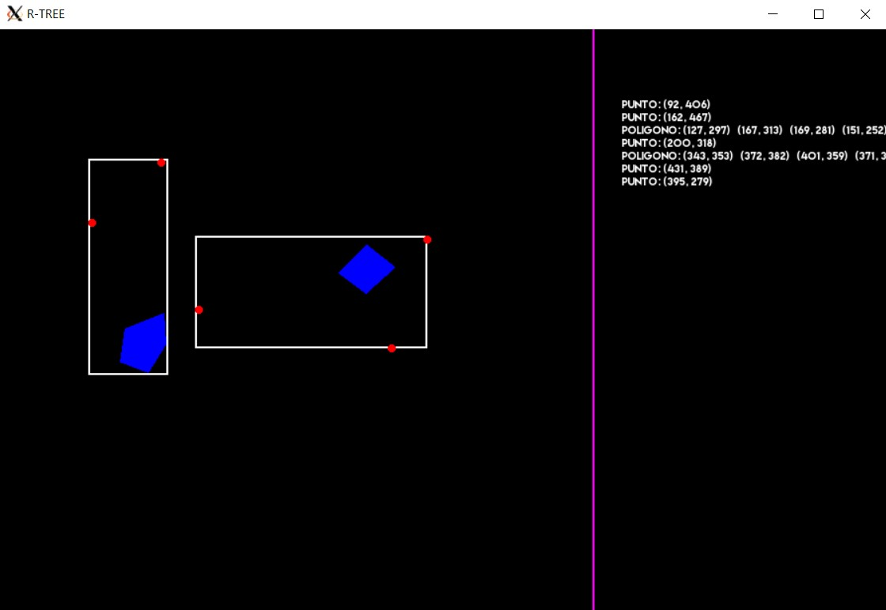

# R-Tree



## Controles
- Tecla **P**: insertar un polígono
    - Si se dan clics en el plano, apareceran puntos amarillos temporales. 
    - Para terminar la inserción, hacer clic en el espacio de aparición de información.
- Tecla **C**: insertar una coordenada
    - Dar clic en el plano
- Tecla **B**: buscar 3 vecinos más cercanos
    - Dar clic en el plano
- Tecla **E**: Eliminar una coordenada
    - Eliminar polígono:
        - Hacer clic dentro del polígono
    - Eliminar coordenada:
        - Hacer clic cerca a la coordenada

## Comandos make

### ```make```
Se obtiene el compilado en el directorio ```bin/release```

### ```make run```
Compila y ejecuta el programa

### ```make clean```
Elimina archivos generados por otros comandos **make**

## Variables de entorno para ejecución en WSL

1. Descargar XLaunch
2. Setear el siguiente comando si se utiliza WSL:
```
export DISPLAY=$(route.exe print | grep 0.0.0.0 | head -1 | awk '{print $4}'):0.0
```

